[toc]

# 番荒之冢 --番剧灯塔站

*一番桃李花开尽，惟有青青草色齐。——曾巩《城南》*

## 理念

前端追求简洁风格

提供有效廉价的追番姿势

提供资源分享的bbs讨论


## 大致设计

### 权限分配

| 权限分配                     |     普通用户     | 管理员 |
| :--------------------------- | :--------------: | :----: |
| ~~新增用户(暂未开放此功能)~~ | (注册,※邮箱验证) |   ✔    |
| 删除用户                     |   (※自己注销)    |   ✔    |
| 查看/编辑个人资料            |        ✔         |   ✔    |
| 查看他人资料                 |        ✔         |   ✔    |
|                              |                  |        |
| 番剧信息『**增删改**』       |                  |   ✔    |
| 番剧信息『**查**』           |        ✔         |   ✔    |
|                              |                  |        |
| 查看追番清单; 取消/进行追番  |        ✔         |   ✔    |
|                              |                  |        |
| 留言区发言                   |        ✔         |   ✔    |
| 删除留言                     | (仅能删除自己的) |   ✔    |


### 番剧信息

| 番剧信息                                     |                                        |
| -------------------------------------------- | -------------------------------------- |
| 编号                                         |                                        |
| 番名                                         |                                        |
| 封面                                         | 默认路径为:`static/picture/pic404.png` |
| 状态(连载中/ 已完结)                         |                                        |
| 上映年份                                     |                                        |
| 追番人数                                     |                                        |
| 有效跳转链接(null:暂无资源,可以在留言区补充) |                                        |

默认封面

### 用户/管理员信息

|              用户              |                                       |
| :----------------------------: | ------------------------------------- |
|             uid号              |                                       |
|  权限等级(1:管理员 / 2:用户)   |                                       |
|              昵称              |                                       |
|              邮箱              |                                       |
|              密码              |                                       |
|        头像(目前为默认)        | 默认路径为:`static/picture/user0.jpg` |
|              简介              |                                       |
| 追番清单(~~json:不便于维护~~ ) |                                       |

默认头像


### 邮箱正则匹配

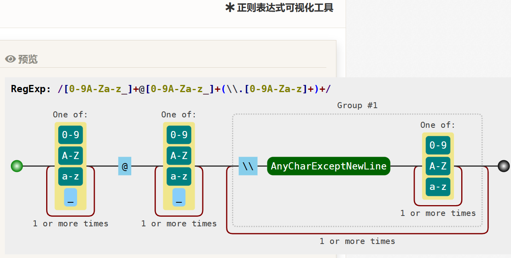
### URL正则匹配

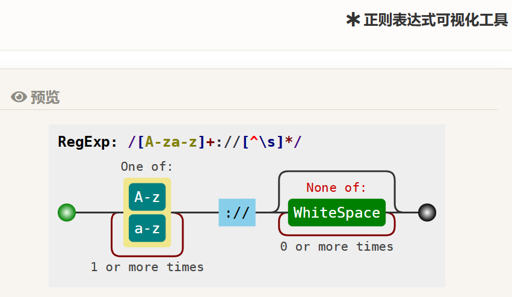


### 留言信息

|        留言        |      |
| :----------------: | ---- |
|        AID         |      |
|        UID         |      |
| 发送时间(自动获取) |      |
|        内容        |      |


## 功能

### 一个简单的登录(进行了路由限制, 若未登录都会跳转至此)

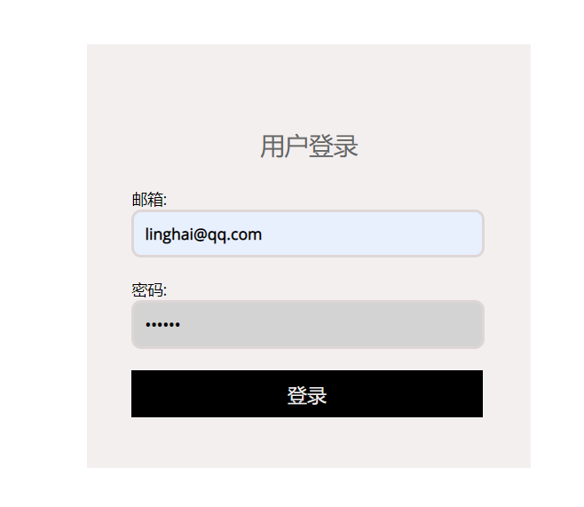

### 首页

+ 可进行关键字查询

+ 分页展示数据库中的已有番剧

+ 展示最新的三条留言

+ 管理员可在此新增番剧

  

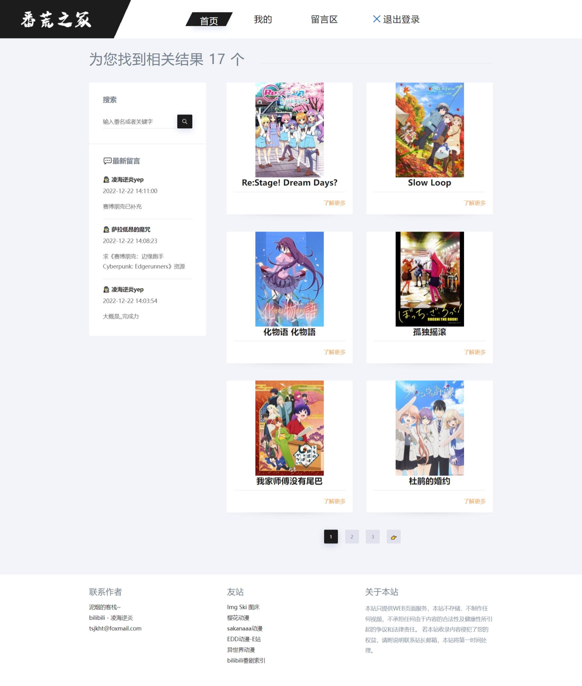

(管理员视角)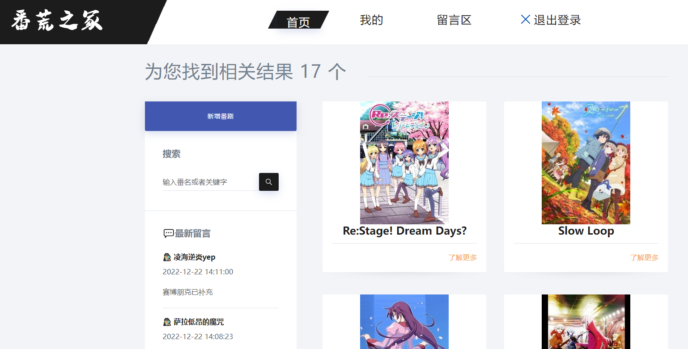

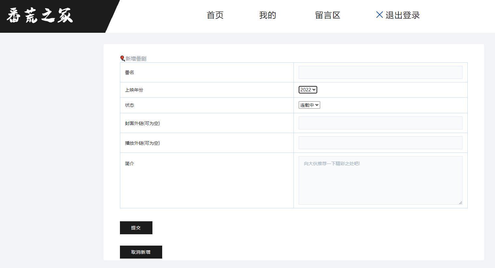


### 我的

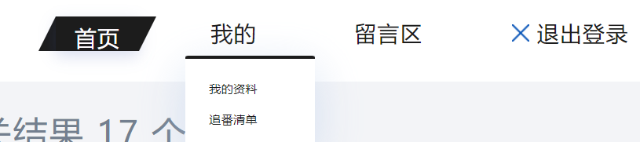


#### 我的资料

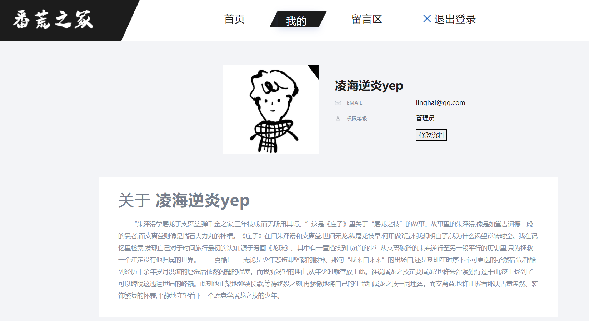


修改资料

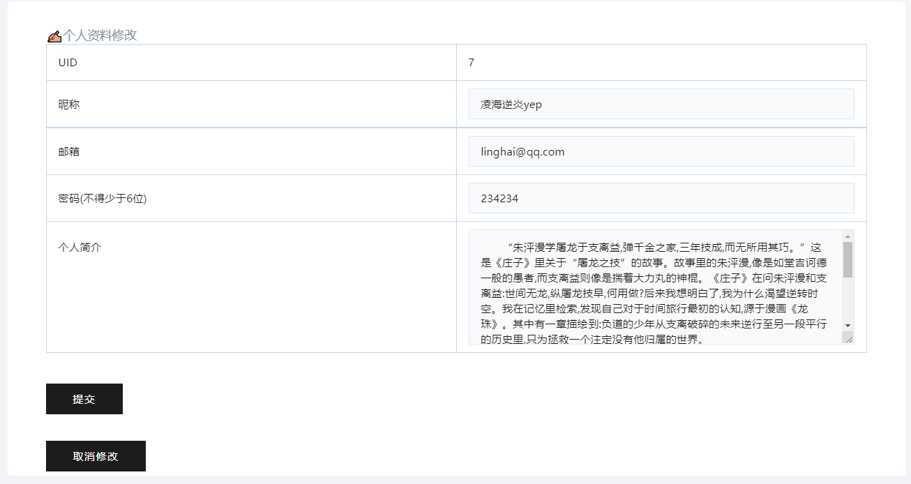


#### 追番清单

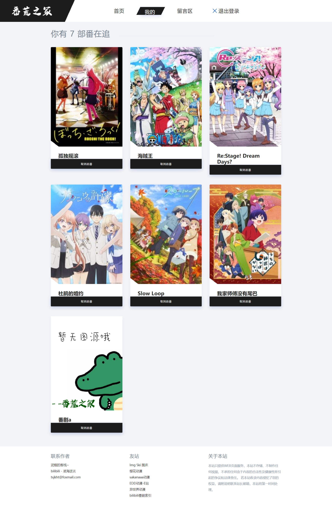

### 留言区

+ 可查看最新留言,删除自己的留言

+ 查看他人资料

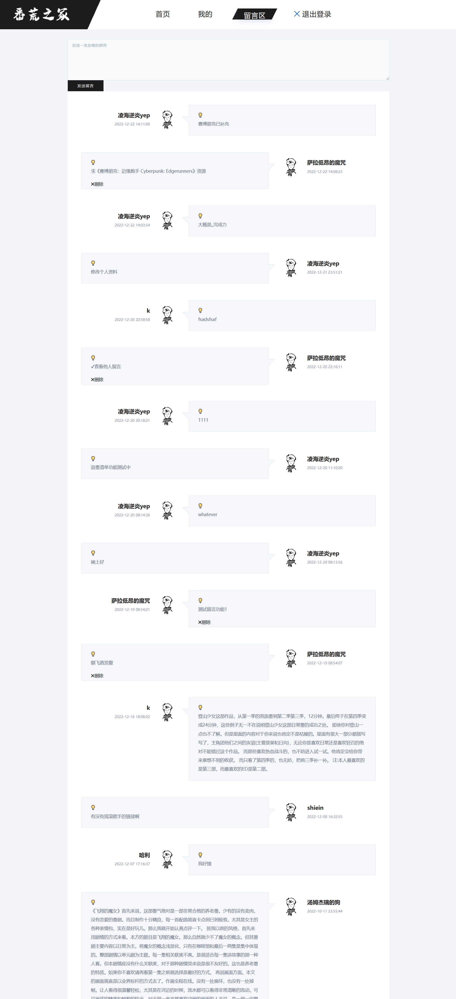

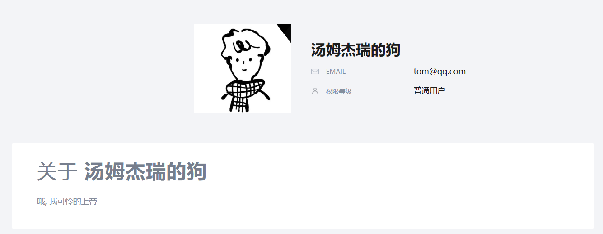


### 番剧详情

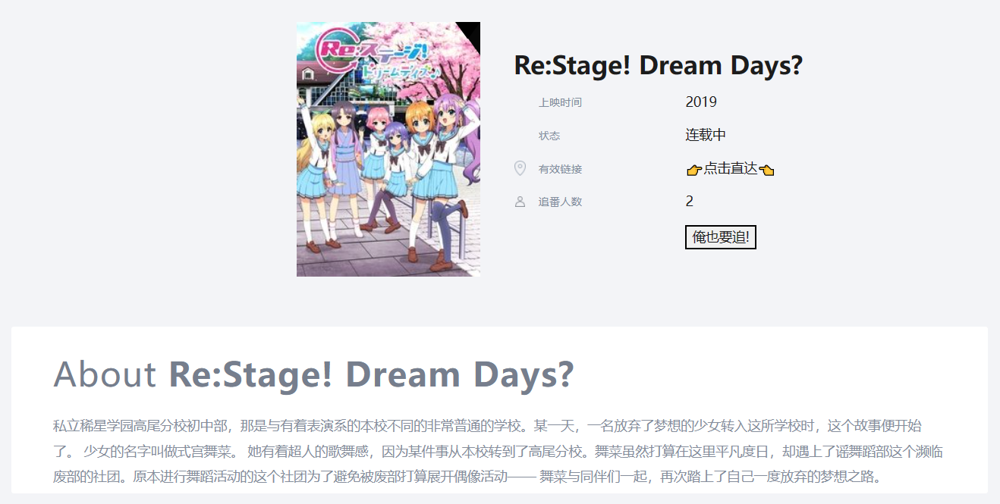

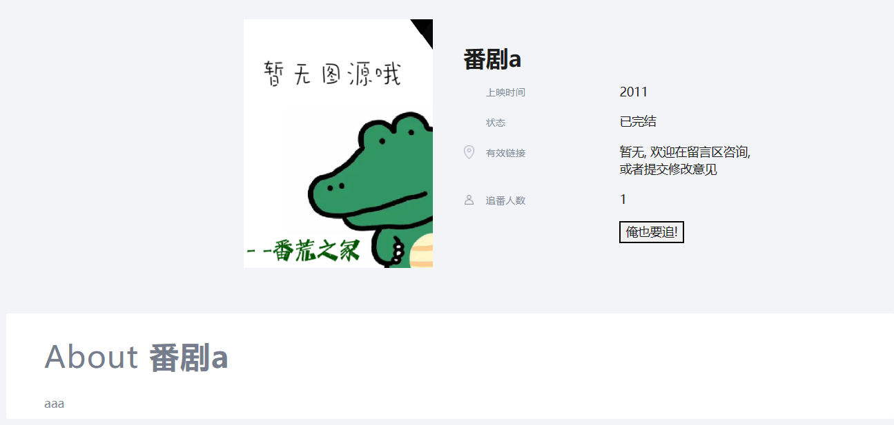

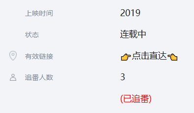

管理员可进行编辑

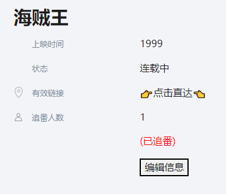

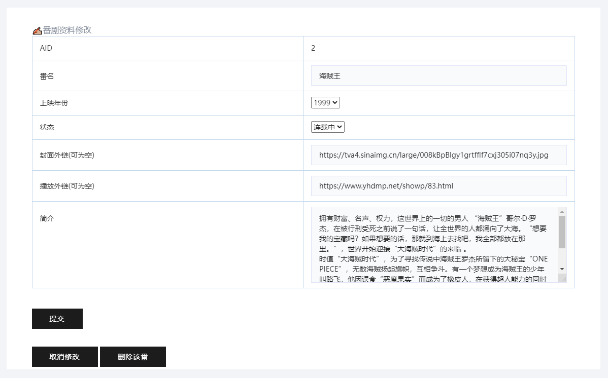


### 退出登录


## 待补充功能(与其它功能同理,不再维护)

### 分页过多

页数太多时的处理方案实现


### 番剧类型

尚未添加


### 图像上传

使用图库的api接口

```
https://img.ski/page/api-docs.html
https://imgse.com/page/plugin
https://www.kjava.com/
```


### 新用户注册

使用邮箱验证码进行注册


## 联系作者

📪: tsjkhtfoxmail.com

[泥烟の客栈](https://www.cnblogs.com/knight02)

[凌海逆炎のbilibili](https://space.bilibili.com/398743455)

[仓库已开源: animation: 番荒之冢 - - 番剧灯塔站 (gitee.com)](https://gitee.com/knight-02/animation)

